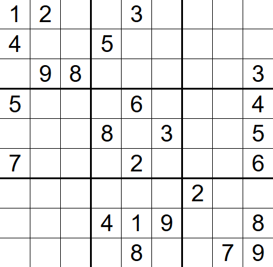

# Valid Sudoku

- **Difficulty**: Medium
- **Category**: Arrays & Hashing
- **Topics**: array, hash table, matrix
- **Link**: [NeetCode](https://neetcode.io/problems/valid-sudoku) | [LeetCode 36](https://leetcode.com/problems/valid-sudoku/)

## Description

Determine if a `9 x 9` Sudoku board is valid. Only the filled cells need to be validated according to the following rules:

1. Each row must contain the digits `1-9` without repetition.
2. Each column must contain the digits `1-9` without repetition.
3. Each of the nine `3 x 3` sub-boxes of the grid must contain the digits `1-9` without repetition.

Note that a Sudoku board being valid does not necessarily mean it is solvable. Only the filled cells need to be validated. Empty cells are represented by the character `'.'`.



## Examples

**Example 1:**

```
Input: board =
[["5","3",".",".","7",".",".",".","."]
,["6",".",".","1","9","5",".",".","."]
,[".","9","8",".",".",".",".","6","."]
,["8",".",".",".","6",".",".",".","3"]
,["4",".",".","8",".","3",".",".","1"]
,["7",".",".",".","2",".",".",".","6"]
,[".","6",".",".",".",".","2","8","."]
,[".",".",".","4","1","9",".",".","5"]
,[".",".",".",".","8",".",".","7","9"]]
Output: true
```

**Example 2:**

```
Input: board =
[["5","3",".",".","7",".",".","5","."]
,["6",".",".","1","9","5",".",".","."]
,[".","9","8",".",".",".",".","6","."]
,["8",".",".",".","6",".",".",".","3"]
,["4",".",".","8",".","3",".",".","1"]
,["7",".",".",".","2",".",".",".","6"]
,[".","6",".",".",".",".","2","8","."]
,[".",".",".","4","1","9",".",".","5"]
,[".",".",".",".","8",".",".","7","9"]]
Output: false
Explanation: The first row contains two 5's, which violates the rule.
```

## Constraints

- `board.length == 9`
- `board[i].length == 9`
- `board[i][j]` is a digit `1-9` or `'.'`.

## Function Signature

```go
func isValidSudoku(board [][]byte) bool
```
