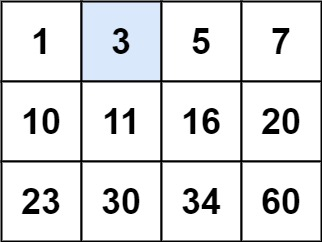

# Search a 2D Matrix

- **Difficulty**: Medium
- **Category**: Binary Search
- **Topics**: binary search, matrix
- **Link**: [NeetCode](https://neetcode.io/problems/search-2d-matrix) | [LeetCode 74](https://leetcode.com/problems/search-a-2d-matrix/)

## Description

You are given an `m x n` integer matrix `matrix` with the following two properties:
- Each row is sorted in non-decreasing order.
- The first integer of each row is greater than the last integer of the previous row.

Given an integer `target`, return `true` if `target` is in `matrix` or `false` otherwise. You must write a solution in O(log(m * n)) time complexity.

## Examples

**Example 1:**



```
Input: matrix = [[1,3,5,7],[10,11,16,20],[23,30,34,60]], target = 3
Output: true
Explanation: 3 is found in the first row.
```

**Example 2:**


```
Input: matrix = [[1,3,5,7],[10,11,16,20],[23,30,34,60]], target = 13
Output: false
Explanation: 13 is not present in any row of the matrix.
```

**Example 3:**

```
Input: matrix = [[1]], target = 1
Output: true
Explanation: The matrix has a single element which equals the target.
```

## Constraints

- `m == matrix.length`
- `n == matrix[i].length`
- `1 <= m, n <= 100`
- `-10^4 <= matrix[i][j], target <= 10^4`

## Function Signature

```go
func searchMatrix(matrix [][]int, target int) bool
```
