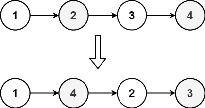
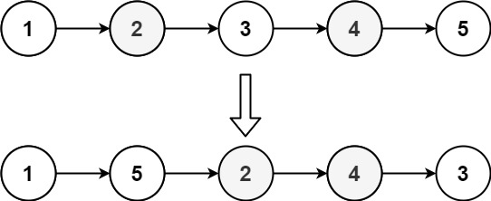

# Reorder List

- **Difficulty**: Medium
- **Category**: Linked List
- **Topics**: linked list, two pointers, reverse
- **Link**: [NeetCode](https://neetcode.io/problems/reorder-linked-list) | [LeetCode 143](https://leetcode.com/problems/reorder-list/)

## Description

You are given the head of a singly linked list. The list can be represented as:

`L0 -> L1 -> ... -> Ln-1 -> Ln`

Reorder the list to be in the following form:

`L0 -> Ln -> L1 -> Ln-1 -> L2 -> Ln-2 -> ...`

You may not modify the values in the list's nodes. Only nodes themselves may be changed. The reordering must be done in place.

## Examples

**Example 1:**



```
Input: head = [1,2,3,4]
Output: [1,4,2,3]
Explanation: The list is reordered by interleaving from both ends.
```

**Example 2:**



```
Input: head = [1,2,3,4,5]
Output: [1,5,2,4,3]
Explanation: The list is reordered: first, last, second, second-to-last, middle.
```

**Example 3:**

```
Input: head = [1,2,3]
Output: [1,3,2]
Explanation: L0->L2->L1.
```

## Constraints

- The number of nodes in the list is in the range `[1, 5 * 10^4]`
- `1 <= Node.Val <= 1000`

## Function Signature

```go
func reorderList(head *ListNode)
```
