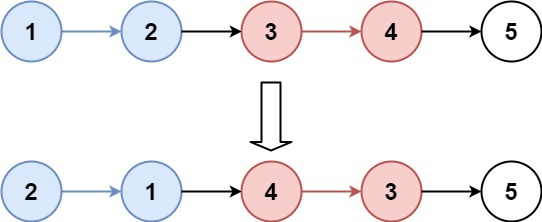

# K 个一组翻转链表

- **难度**：困难
- **分类**：链表
- **考点**：链表、递归、迭代
- **链接**：[NeetCode](https://neetcode.io/problems/reverse-nodes-in-k-group) | [力扣 25](https://leetcode.cn/problems/reverse-nodes-in-k-group/)

## 题目描述

给你链表的头节点 `head`，每 `k` 个节点一组进行翻转，请你返回修改后的链表。

`k` 是一个正整数，它的值小于或等于链表的长度。如果节点总数不是 `k` 的整数倍，那么请将最后剩余的节点保持原有顺序。

你不能只是单纯地改变节点内部的值，而是需要实际进行节点交换。

## 示例

**示例 1：**



```
输入：head = [1,2,3,4,5], k = 2
输出：[2,1,4,3,5]
解释：每 2 个节点一组进行翻转。最后一个节点（5）没有完整的组，保持原样。
```

**示例 2：**


```
输入：head = [1,2,3,4,5], k = 3
输出：[3,2,1,4,5]
解释：只有前 3 个节点被翻转，剩余的 2 个节点保持原有顺序。
```

**示例 3：**

```
输入：head = [1,2,3,4], k = 2
输出：[2,1,4,3]
解释：两个完整的 2 节点组分别被翻转。
```

## 约束条件

- 链表中的节点数目为 `n`
- `1 <= k <= n <= 5000`
- `0 <= Node.Val <= 1000`

## 函数签名

```go
func reverseKGroup(head *ListNode, k int) *ListNode
```
