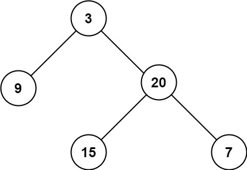

# Maximum Depth of Binary Tree

- **Difficulty**: Easy
- **Category**: Trees
- **Topics**: binary tree, recursion, DFS
- **Link**: [NeetCode](https://neetcode.io/problems/depth-of-binary-tree) | [LeetCode 104](https://leetcode.com/problems/maximum-depth-of-binary-tree/)

## Description



Given the root of a binary tree, return its maximum depth. The maximum depth is the number of nodes along the longest path from the root node down to the farthest leaf node. A leaf is a node with no children.

## Examples

**Example 1:**

```
Input: root = [3,9,20,null,null,15,7]
Output: 3
Explanation: The longest path is root(3) -> right(20) -> left(15) or right(7), which has 3 nodes.
```

**Example 2:**

```
Input: root = [1,null,2]
Output: 2
Explanation: The tree has only a right child, so the depth is 2.
```

**Example 3:**

```
Input: root = []
Output: 0
Explanation: An empty tree has depth 0.
```

## Constraints

- The number of nodes in the tree is in the range `[0, 10^4]`.
- `-100 <= Node.val <= 100`

## Function Signature

```go
func maxDepth(root *TreeNode) int
```
