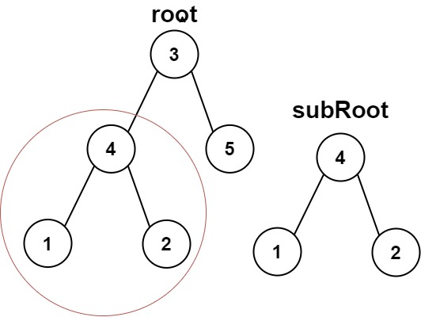
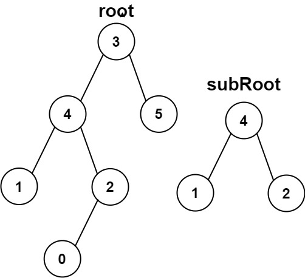

# 另一棵树的子树

- **难度**: 简单
- **分类**: 树
- **考点**: 二叉树, 深度优先搜索, 递归
- **链接**: [NeetCode](https://neetcode.io/problems/subtree-of-a-binary-tree) | [力扣 572](https://leetcode.cn/problems/subtree-of-another-tree/)

## 题目描述

给你两棵二叉树 `root` 和 `subRoot`。检验 `root` 中是否包含和 `subRoot` 具有相同结构和节点值的子树。如果存在，返回 `true`；否则，返回 `false`。二叉树的一棵子树包括某个节点及其所有后代节点。整棵树本身也可以被视为自身的一棵子树。

## 示例

**示例 1:**



```
输入: root = [3,4,5,1,2], subRoot = [4,1,2]
输出: true
解释: root 中以节点 4 为根的子树与 subRoot 完全匹配。
```

**示例 2:**



```
输入: root = [3,4,5,1,2,null,null,null,null,0], subRoot = [4,1,2]
输出: false
解释: 以节点 4 为根的子树在节点 2 下多了一个子节点 0，因此不匹配 subRoot。
```

**示例 3:**

```
输入: root = [1], subRoot = [1]
输出: true
解释: 整棵树与 subRoot 完全相同。
```

## 约束条件

- `root` 树中节点数目范围在 `[1, 2000]` 内。
- `subRoot` 树中节点数目范围在 `[1, 1000]` 内。
- `-10^4 <= root.val <= 10^4`
- `-10^4 <= subRoot.val <= 10^4`

## 函数签名

```go
func isSubtree(root *TreeNode, subRoot *TreeNode) bool
```
