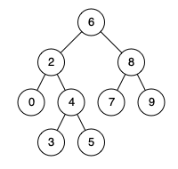

# Lowest Common Ancestor of a Binary Search Tree

- **Difficulty**: Medium
- **Category**: Trees
- **Topics**: binary search tree, BST properties, iteration
- **Link**: [NeetCode](https://neetcode.io/problems/lowest-common-ancestor-in-binary-search-tree) | [LeetCode 235](https://leetcode.com/problems/lowest-common-ancestor-of-a-binary-search-tree/)

## Description



Given a binary search tree (BST) and two nodes `p` and `q`, find their lowest common ancestor (LCA). The lowest common ancestor is defined as the deepest node in the tree that has both `p` and `q` as descendants (where a node is allowed to be a descendant of itself). All node values in the BST are unique, and both `p` and `q` are guaranteed to exist in the tree.

## Examples

**Example 1:**

```
Input: root = [6,2,8,0,4,7,9,null,null,3,5], p = 2, q = 8
Output: 6
Explanation: The LCA of nodes 2 and 8 is the root node 6, since 2 is in the left subtree and 8 is in the right subtree.
```

**Example 2:**

```
Input: root = [6,2,8,0,4,7,9,null,null,3,5], p = 2, q = 4
Output: 2
Explanation: The LCA of nodes 2 and 4 is node 2, since 4 is a descendant of 2 and a node can be its own ancestor.
```

**Example 3:**

```
Input: root = [2,1,3], p = 1, q = 3
Output: 2
Explanation: The LCA of nodes 1 and 3 is the root node 2.
```

## Constraints

- The number of nodes in the tree is in the range `[2, 10^5]`.
- `-10^9 <= Node.val <= 10^9`
- All `Node.val` are unique.
- `p != q`
- `p` and `q` will exist in the BST.

## Function Signature

```go
func lowestCommonAncestor(root *TreeNode, p *TreeNode, q *TreeNode) *TreeNode
```
