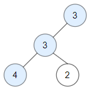

# 统计二叉树中好节点的数目

- **难度**: 中等
- **分类**: 树
- **考点**: 二叉树, 深度优先搜索, 递归
- **链接**: [NeetCode](https://neetcode.io/problems/count-good-nodes-in-binary-tree) | [力扣 1448](https://leetcode.cn/problems/count-good-nodes-in-binary-tree/)

## 题目描述

给你一棵根为 `root` 的二叉树，如果从根到节点 X 的路径上没有任何节点的值大于 X 的值，则称节点 X 为"好节点"。返回二叉树中好节点的数目。根节点始终被视为好节点。

## 示例

**示例 1:**


```
输入: root = [3,1,4,3,null,1,5]
输出: 4
解释: 好节点有：根节点 3，节点 3（左左，路径最大值为 3），节点 4（右，4 >= 3），节点 5（右右，5 >= 4）。节点 1（左）不是好节点，因为 3 > 1。
```

**示例 2:**



```
输入: root = [3,3,null,4,2]
输出: 3
解释: 好节点有：根节点 3，节点 3（左，3 >= 3），节点 4（左左，4 >= 3）。节点 2 不是好节点，因为 3 > 2。
```

**示例 3:**

```
输入: root = [1]
输出: 1
解释: 根节点始终是好节点。
```

## 约束条件

- 二叉树中节点数目范围在 `[1, 10^5]` 内。
- 每个节点的值在 `[-10^4, 10^4]` 之间。

## 函数签名

```go
func goodNodes(root *TreeNode) int
```
