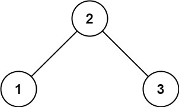

# 验证二叉搜索树

- **难度**: 中等
- **分类**: 树
- **考点**: 二叉搜索树, 深度优先搜索, 递归
- **链接**: [NeetCode](https://neetcode.io/problems/valid-binary-search-tree) | [力扣 98](https://leetcode.cn/problems/validate-binary-search-tree/)

## 题目描述

给你一棵二叉树的根节点，判断其是否是一个有效的二叉搜索树（BST）。有效 BST 定义如下：节点的左子树只包含键值严格小于该节点键值的节点，右子树只包含键值严格大于该节点键值的节点，且左右子树也必须是有效的二叉搜索树。

## 示例

**示例 1:**



```
输入: root = [2,1,3]
输出: true
解释: 节点 1 < 2（有效左子节点），节点 3 > 2（有效右子节点）。
```

**示例 2:**


```
输入: root = [5,1,4,null,null,3,6]
输出: false
解释: 根节点的值为 5，但其右子节点为 4，小于 5。这违反了 BST 性质。
```

**示例 3:**

```
输入: root = [5,4,6,null,null,3,7]
输出: false
解释: 节点 3 位于根节点 5 的右子树中，但值为 3，小于 5。即使 3 < 6（其父节点），它也违反了相对于根节点的 BST 约束。
```

## 约束条件

- 树中节点数目范围在 `[1, 10^4]` 内。
- `-2^31 <= Node.val <= 2^31 - 1`

## 函数签名

```go
func isValidBST(root *TreeNode) bool
```
