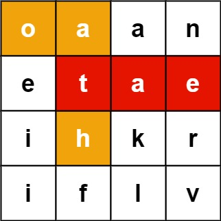
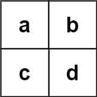

# 单词搜索 II

- **难度**: 困难
- **分类**: 前缀树
- **考点**: 前缀树, 回溯, 深度优先搜索, 矩阵
- **链接**: [NeetCode](https://neetcode.io/problems/search-for-word-ii) | [力扣 212](https://leetcode.cn/problems/word-search-ii/)

## 题目描述

给定一个 `m x n` 的字符面板和一个单词列表 `words`，返回面板上所有能找到的单词。每个单词必须按照字母顺序，由相邻的单元格中的字母构成，其中"相邻"单元格是水平或垂直相邻的单元格。同一个单元格内的字母在一个单词中不允许被重复使用。

## 示例

**示例 1:**



```
输入: board = [["o","a","a","n"],["e","t","a","e"],["i","h","k","r"],["i","f","l","v"]], words = ["oath","pea","eat","rain"]
输出: ["eat","oath"]
解释: "eat" 可以从 board[1][2] -> board[1][1] -> board[0][1] 形成。"oath" 可以从 board[0][0] -> board[0][1] -> board[1][1] -> board[1][0] 形成。"pea" 和 "rain" 无法形成。
```

**示例 2:**



```
输入: board = [["a","b"],["c","d"]], words = ["abcb"]
输出: []
解释: "abcb" 需要重复访问 'b' 单元格，这是不允许的。
```

**示例 3:**

```
输入: board = [["a"]], words = ["a"]
输出: ["a"]
解释: 单个单元格匹配单字符单词。
```

## 约束条件

- `m == board.length`
- `n == board[i].length`
- `1 <= m, n <= 12`
- `board[i][j]` 是一个小写英文字母。
- `1 <= words.length <= 3 * 10^4`
- `1 <= words[i].length <= 10`
- `words[i]` 由小写英文字母组成。
- `words` 中的所有字符串互不相同。

## 函数签名

```go
func findWords(board [][]byte, words []string) []string
```
