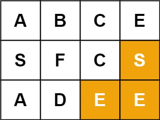

# 单词搜索

- **难度**: 中等
- **分类**: 回溯
- **考点**: 回溯, 深度优先搜索, 矩阵
- **链接**: [NeetCode](https://neetcode.io/problems/search-for-word) | [力扣 79](https://leetcode.cn/problems/word-search/)

## 题目描述

给定一个 `m x n` 二维字符网格 `board` 和一个字符串单词 `word`。如果 `word` 存在于网格中，返回 `true`；否则返回 `false`。

单词必须按照字母顺序，通过相邻的单元格内的字母构成，其中"相邻"单元格是那些水平相邻或垂直相邻的单元格。同一个单元格内的字母不允许被重复使用。

## 示例

**示例 1:**


```
输入: board = [["A","B","C","E"],["S","F","C","S"],["A","D","E","E"]], word = "ABCCED"
输出: true
解释: 单词 "ABCCED" 可以沿路径 A(0,0)->B(0,1)->C(0,2)->C(1,2)->E(2,2)->D(2,1) 找到。
```

**示例 2:**



```
输入: board = [["A","B","C","E"],["S","F","C","S"],["A","D","E","E"]], word = "SEE"
输出: true
```

**示例 3:**


```
输入: board = [["A","B","C","E"],["S","F","C","S"],["A","D","E","E"]], word = "ABCB"
输出: false
解释: 路径需要重复使用单元格，这是不允许的。
```

## 约束条件

- `m == board.length`
- `n == board[i].length`
- `1 <= m, n <= 6`
- `1 <= word.length <= 15`
- `board` 和 `word` 仅由大小写英文字母组成。

## 函数签名

```go
func exist(board [][]byte, word string) bool
```
