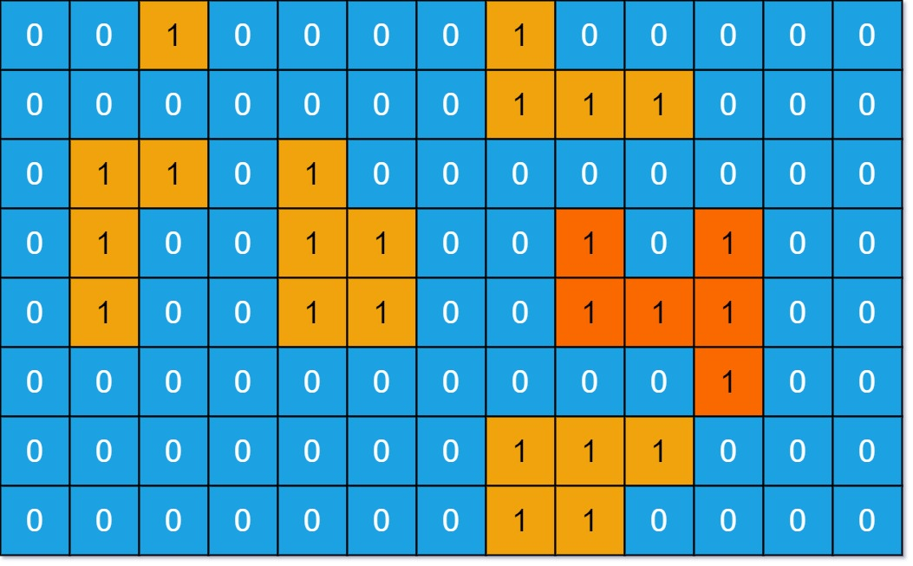

# 岛屿的最大面积

- **难度**: 中等
- **分类**: 图
- **考点**: 深度优先搜索, 广度优先搜索, 矩阵, 洪水填充
- **链接**: [NeetCode](https://neetcode.io/problems/max-area-of-island) | [力扣 695](https://leetcode.cn/problems/max-area-of-island/)

## 题目描述

给你一个大小为 `m x n` 的二进制矩阵 `grid`。岛屿是由一些相邻的 `1`（代表土地）构成的组合，这里的「相邻」要求两个 `1` 必须在水平或者垂直的四个方向上相邻。你可以假设 `grid` 的四个边缘都被 `0`（代表水）包围着。

岛屿的面积是岛上值为 `1` 的单元格的数目。计算并返回 `grid` 中最大的岛屿面积。如果没有岛屿，则返回 `0`。



## 示例

**示例 1:**

```
输入: grid = [
  [0,0,1,0,0,0,0,1,0,0,0,0,0],
  [0,0,0,0,0,0,0,1,1,1,0,0,0],
  [0,1,1,0,1,0,0,0,0,0,0,0,0],
  [0,1,0,0,1,1,0,0,1,0,1,0,0],
  [0,1,0,0,1,1,0,0,1,1,1,0,0],
  [0,0,0,0,0,0,0,0,0,0,1,0,0],
  [0,0,0,0,0,0,0,1,1,1,0,0,0],
  [0,0,0,0,0,0,0,1,1,0,0,0,0]
]
输出: 6
解释: 最大的岛屿面积为 6（右下方区域的连通分量）。
```

**示例 2:**

```
输入: grid = [[0,0,0],[0,0,0]]
输出: 0
```

**示例 3:**

```
输入: grid = [[1,1],[1,1]]
输出: 4
```

## 约束条件

- `m == grid.length`
- `n == grid[i].length`
- `1 <= m, n <= 50`
- `grid[i][j]` 为 `0` 或 `1`。

## 函数签名

```go
func maxAreaOfIsland(grid [][]int) int
```
