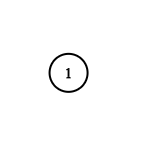

# Clone Graph

- **Difficulty**: Medium
- **Category**: Graphs
- **Topics**: DFS, BFS, hash map, graph traversal
- **Link**: [NeetCode](https://neetcode.io/problems/clone-graph) | [LeetCode 133](https://leetcode.com/problems/clone-graph/)

## Description

Given a reference of a node in a connected undirected graph, return a deep copy (clone) of the graph. Each node in the graph contains a value (`int`) and a list (`[]Node`) of its neighbors.

The graph is represented in the test case using an adjacency list. Each node's value is the same as the node's index (1-indexed). The returned cloned graph must consist of entirely new node objects, with no shared pointers to the original graph's nodes.

## Examples

**Example 1:**


```
Input: adjList = [[2,4],[1,3],[2,4],[1,3]]
Output: [[2,4],[1,3],[2,4],[1,3]]
Explanation: There are 4 nodes in the graph. Node 1 connects to nodes 2 and 4. Node 2 connects to nodes 1 and 3. The clone is a deep copy with new node objects.
```

**Example 2:**



```
Input: adjList = [[]]
Output: [[]]
Explanation: A single node with no neighbors.
```

**Example 3:**

```
Input: adjList = []
Output: []
Explanation: The graph is empty (null input).
```

## Constraints

- The number of nodes in the graph is in the range `[0, 100]`.
- `1 <= Node.val <= 100`
- `Node.val` is unique for each node.
- There are no repeated edges and no self-loops in the graph.
- The graph is connected and all nodes can be visited starting from the given node.

## Function Signature

```go
type Node struct {
    Val       int
    Neighbors []*Node
}

func cloneGraph(node *Node) *Node
```
