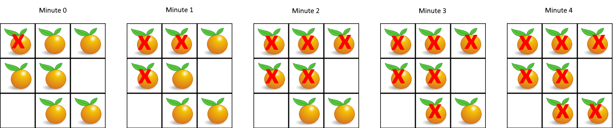

# 腐烂的橘子

- **难度**: 中等
- **分类**: 图
- **考点**: 广度优先搜索, 多源BFS, 矩阵
- **链接**: [NeetCode](https://neetcode.io/problems/rotting-fruit) | [力扣 994](https://leetcode.cn/problems/rotting-oranges/)

## 题目描述

在给定的 `m x n` 网格 `grid` 中，每个单元格可以有以下三个值之一：

- `0` 代表空单元格；
- `1` 代表新鲜橘子；
- `2` 代表腐烂的橘子。

每分钟，腐烂的橘子周围 4 个方向上相邻的新鲜橘子都会腐烂。返回直到单元格中没有新鲜橘子为止所必须经过的最小分钟数。如果不可能，返回 `-1`。



## 示例

**示例 1:**

```
输入: grid = [[2,1,1],[1,1,0],[0,1,1]]
输出: 4
```

**示例 2:**

```
输入: grid = [[2,1,1],[0,1,1],[1,0,1]]
输出: -1
解释: 左下角的橘子永远不会被任何腐烂的橘子影响到。
```

**示例 3:**

```
输入: grid = [[0,2]]
输出: 0
解释: 没有新鲜橘子，所以不需要等待。
```

## 约束条件

- `m == grid.length`
- `n == grid[i].length`
- `1 <= m, n <= 10`
- `grid[i][j]` 的值为 `0`、`1` 或 `2`。

## 函数签名

```go
func orangesRotting(grid [][]int) int
```
