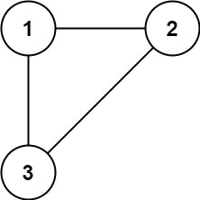
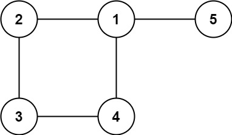

# Redundant Connection

- **Difficulty**: Medium
- **Category**: Graphs
- **Topics**: union find, graph, cycle detection
- **Link**: [NeetCode](https://neetcode.io/problems/redundant-connection) | [LeetCode 684](https://leetcode.com/problems/redundant-connection/)

## Description

In this problem, a tree is an undirected graph that is connected and has no cycles. You are given a graph that started as a tree with `n` nodes labeled from `1` to `n`, with one additional edge added. The added edge connects two different nodes that are already connected, creating exactly one cycle.

Return an edge that can be removed so that the resulting graph is a tree of `n` nodes. If there are multiple answers, return the answer that occurs last in the input.

## Examples

**Example 1:**



```
Input: edges = [[1,2],[1,3],[2,3]]
Output: [2,3]
```

**Example 2:**



```
Input: edges = [[1,2],[2,3],[3,4],[1,4],[1,5]]
Output: [1,4]
```

**Example 3:**

```
Input: edges = [[1,2],[2,3],[3,4],[4,5],[5,1]]
Output: [5,1]
Explanation: Removing the last edge [5,1] breaks the cycle.
```

## Constraints

- `n == edges.length`
- `3 <= n <= 1000`
- `edges[i].length == 2`
- `1 <= ai < bi <= edges.length`
- `ai != bi`
- There are no repeated edges.
- The given graph is connected.

## Function Signature

```go
func findRedundantConnection(edges [][]int) []int
```
