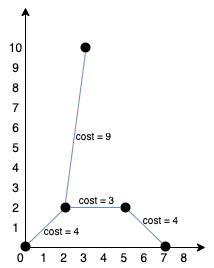

# 连接所有点的最小费用

- **难度**: 中等
- **分类**: 高级图
- **考点**: 最小生成树, Prim 算法, 堆
- **链接**: [NeetCode](https://neetcode.io/problems/min-cost-to-connect-points) | [力扣 1584](https://leetcode.cn/problems/min-cost-to-connect-all-points/)

## 题目描述

给你一个 `points` 数组，表示 2D 平面上的一些点，其中 `points[i] = [xi, yi]`。

连接点 `[xi, yi]` 和点 `[xj, yj]` 的费用为它们之间的曼哈顿距离：`|xi - xj| + |yi - yj|`。

请你返回将所有点连接的最小总费用。只有任意两点之间有且仅有一条简单路径时，才认为所有点都已连接。

## 示例

**示例 1:**


```
输入: points = [[0,0],[2,2],[3,10],[5,2],[7,0]]
输出: 20
```

**示例 2:**



```
输入: points = [[3,12],[-2,5],[-4,1]]
输出: 18
```

**示例 3:**

```
输入: points = [[0,0],[1,1]]
输出: 2
解释: 两点之间的曼哈顿距离为 |0-1| + |0-1| = 2。
```

## 约束条件

- `1 <= points.length <= 1000`
- `-10^6 <= xi, yi <= 10^6`
- 所有点 `(xi, yi)` 互不相同。

## 函数签名

```go
func minCostConnectPoints(points [][]int) int
```
