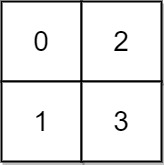
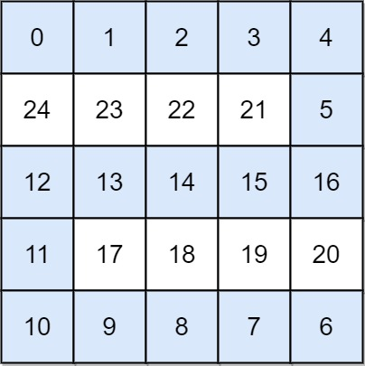

# 水位上升的泳池中游泳

- **难度**: 困难
- **分类**: 高级图
- **考点**: Dijkstra 算法, 堆, 二分查找, 广度优先搜索
- **链接**: [NeetCode](https://neetcode.io/problems/swim-in-rising-water) | [力扣 778](https://leetcode.cn/problems/swim-in-rising-water/)

## 题目描述

在一个 `n x n` 的整数方阵 `grid` 中，每个值 `grid[i][j]` 表示位置 `(i, j)` 的平台高度。

当开始下雨时，在时间 `t` 时，水池中的水位为 `t`。你可以从一个平台游向四方向相邻的任意一个平台，但前提是此时水位必须同时淹没出发和到达平台。假定你可以瞬间移动无限距离，但必须保持在网格范围内。

你从坐标 `(0, 0)` 出发。返回你到达坐标 `(n - 1, n - 1)` 所需的最少时间。

## 示例

**示例 1:**



```
输入: grid = [[0,2],[1,3]]
输出: 3
解释: 在时刻 3，可以从 (0,0) 游到 (1,0) 再到 (1,1)。所有高度都 <= 3。
```

**示例 2:**



```
输入: grid = [
  [0,1,2,3,4],
  [24,23,22,21,5],
  [12,13,14,15,16],
  [11,17,18,19,20],
  [10,9,8,7,6]
]
输出: 16
解释: 最优路径沿右侧和底部行进，路径上的最大高度为 16。
```

**示例 3:**

```
输入: grid = [[0]]
输出: 0
```

## 约束条件

- `n == grid.length`
- `n == grid[i].length`
- `1 <= n <= 50`
- `0 <= grid[i][j] < n^2`
- `grid` 中的每个值都是唯一的。

## 函数签名

```go
func swimInWater(grid [][]int) int
```
