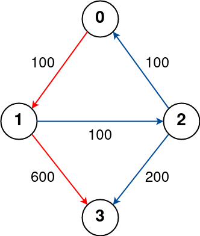
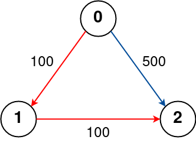
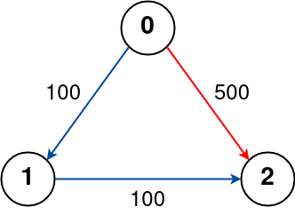

# K 站中转内最便宜的航班

- **难度**: 中等
- **分类**: 高级图
- **考点**: Bellman-Ford 算法, 动态规划, 最短路径
- **链接**: [NeetCode](https://neetcode.io/problems/cheapest-flight-path) | [力扣 787](https://leetcode.cn/problems/cheapest-flights-within-k-stops/)

## 题目描述

有 `n` 个城市通过一些航班连接。给你一个数组 `flights`，其中 `flights[i] = [fromi, toi, pricei]` 表示该航班都从城市 `fromi` 出发，到达城市 `toi`，价格为 `pricei`。

现在给定所有的城市和航班，以及出发城市 `src` 和目的地 `dst`，你的任务是找到出一条最多经过 `k` 站中转的路线，使得从 `src` 到 `dst` 的价格最便宜，并返回该价格。如果不存在这样的路线，则返回 `-1`。

中转站是指 `src` 和 `dst` 之间的中间城市（不包括 `src` 和 `dst`）。

## 示例

**示例 1:**



```
输入: n = 4, flights = [[0,1,100],[1,2,100],[2,0,100],[1,3,600],[2,3,200]], src = 0, dst = 3, k = 1
输出: 700
解释: 路径 0 -> 1 -> 3 费用为 700，经过 1 站中转。
```

**示例 2:**



```
输入: n = 3, flights = [[0,1,100],[1,2,100],[0,2,500]], src = 0, dst = 2, k = 1
输出: 200
解释: 路径 0 -> 1 -> 2 费用为 200，经过 1 站中转，比直飞 500 更便宜。
```

**示例 3:**



```
输入: n = 3, flights = [[0,1,100]], src = 0, dst = 2, k = 1
输出: -1
解释: 不存在从 0 到 2 的路线。
```

## 约束条件

- `1 <= n <= 100`
- `0 <= flights.length <= (n * (n - 1) / 2)`
- `flights[i].length == 3`
- `0 <= fromi, toi < n`
- `fromi != toi`
- `1 <= pricei <= 10^4`
- 没有重复航班。
- `0 <= src, dst, k < n`
- `src != dst`

## 函数签名

```go
func findCheapestPrice(n int, flights [][]int, src int, dst int, k int) int
```
