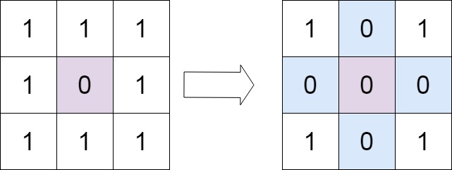

# Set Matrix Zeroes

- **Difficulty**: Medium
- **Category**: Math & Geometry
- **Topics**: array, matrix, hash table
- **Link**: [NeetCode](https://neetcode.io/problems/set-zeroes-in-matrix) | [LeetCode 73](https://leetcode.com/problems/set-matrix-zeroes/)

## Description

Given an `m x n` integer matrix `matrix`, if an element is `0`, set its entire row and column to `0`'s. You must do it in-place without using extra space proportional to the matrix size.

## Examples

**Example 1:**



```
Input: matrix = [[1,1,1],[1,0,1],[1,1,1]]
Output: [[1,0,1],[0,0,0],[1,0,1]]
Explanation: The element at position (1,1) is 0, so its entire row and column are set to 0.
```

**Example 2:**


```
Input: matrix = [[0,1,2,0],[3,4,5,2],[1,3,1,5]]
Output: [[0,0,0,0],[0,4,5,0],[0,3,1,0]]
Explanation: Elements at (0,0) and (0,3) are 0, so their rows and columns are zeroed.
```

**Example 3:**

```
Input: matrix = [[1,2],[3,4]]
Output: [[1,2],[3,4]]
Explanation: No element is 0, so the matrix remains unchanged.
```

## Constraints

- `m == matrix.length`
- `n == matrix[0].length`
- `1 <= m, n <= 200`
- `-2^31 <= matrix[i][j] <= 2^31 - 1`

## Function Signature

```go
func setZeroes(matrix [][]int)
```
